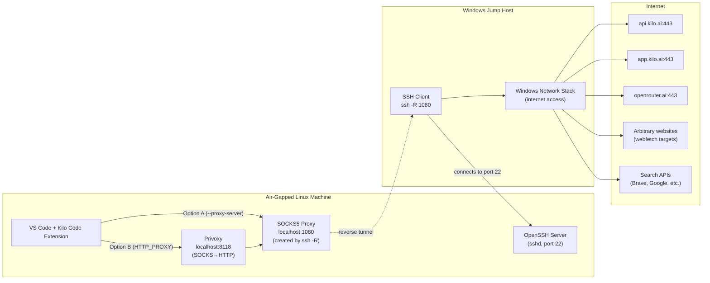
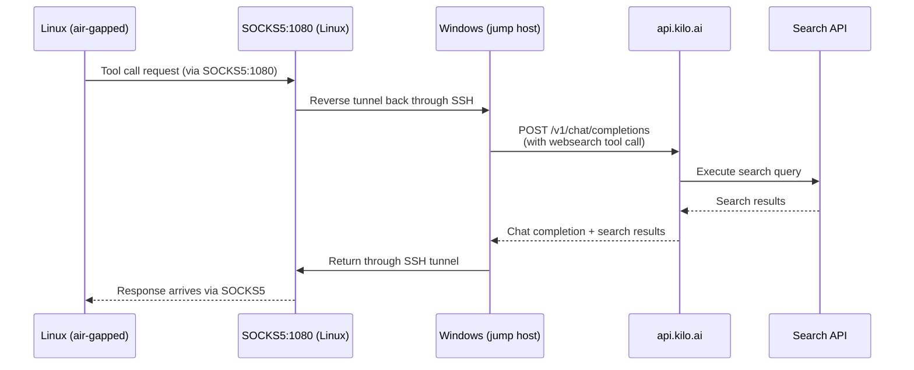
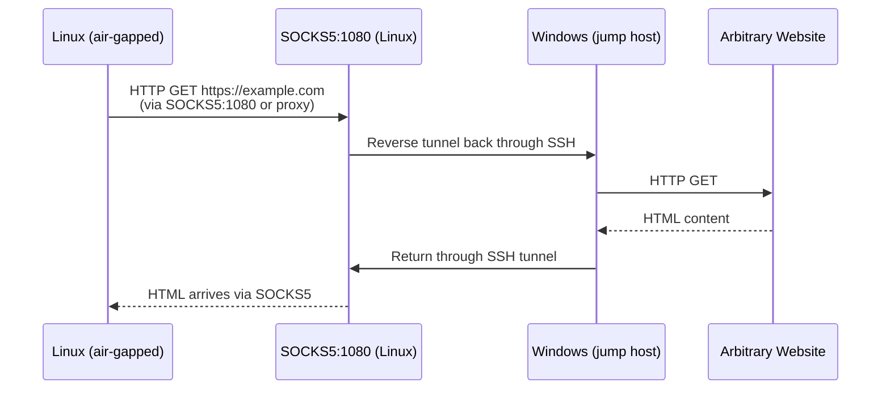
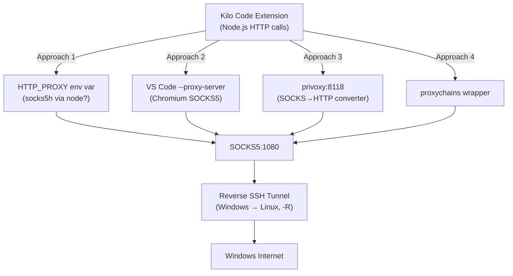

# Network Topology

## Full Architecture

```mermaid
graph LR
    subgraph Linux["Air-Gapped Linux Machine"]
        VSCode["VS Code + Kilo Code Extension"]
        SOCKS["SOCKS5 Proxy\nlocalhost:1080\n(created by ssh -R)"]
        Privoxy["Privoxy\nlocalhost:8118\n(SOCKS→HTTP)"]
        SSHServer["OpenSSH Server\n(sshd, port 22)"]
        VSCode -->|"Option A (--proxy-server)"| SOCKS
        VSCode -->|"Option B (HTTP_PROXY)"| Privoxy
        Privoxy --> SOCKS
    end

    subgraph Windows["Windows Jump Host"]
        SSHClient["SSH Client\nssh -R 1080"]
        NetStack["Windows Network Stack\n(internet access)"]
        SSHClient -->|"connects to port 22"| SSHServer
        SOCKS -.->|"reverse tunnel"| SSHClient
        SSHClient --> NetStack
    end

    subgraph Internet["Internet"]
        KiloAPI["api.kilo.ai:443"]
        KiloApp["app.kilo.ai:443"]
        OpenRouter["openrouter.ai:443"]
        WebSites["Arbitrary websites\n(webfetch targets)"]
        SearchAPIs["Search APIs\n(Brave, Google, etc.)"]
    end

    NetStack --> KiloAPI
    NetStack --> KiloApp
    NetStack --> OpenRouter
    NetStack --> WebSites
    NetStack --> SearchAPIs
```

## Traffic Flow — websearch

```mermaid
sequenceDiagram
    participant Linux as Linux (air-gapped)
    participant SOCKS as SOCKS5:1080 (Linux)
    participant Windows as Windows (jump host)
    participant KiloAPI as api.kilo.ai
    participant Search as Search API

    Linux->>SOCKS: Tool call request (via SOCKS5:1080)
    SOCKS->>Windows: Reverse tunnel back through SSH
    Windows->>KiloAPI: POST /v1/chat/completions<br/>(with websearch tool call)
    KiloAPI->>Search: Execute search query
    Search-->>KiloAPI: Search results
    KiloAPI-->>Windows: Chat completion + search results
    Windows->>SOCKS: Return through SSH tunnel
    SOCKS-->>Linux: Response arrives via SOCKS5
```

## Traffic Flow — webfetch

```mermaid
sequenceDiagram
    participant Linux as Linux (air-gapped)
    participant SOCKS as SOCKS5:1080 (Linux)
    participant Windows as Windows (jump host)
    participant Website as Arbitrary Website

    Linux->>SOCKS: HTTP GET https://example.com<br/>(via SOCKS5:1080 or proxy)
    SOCKS->>Windows: Reverse tunnel back through SSH
    Windows->>Website: HTTP GET
    Website-->>Windows: HTML content
    Windows->>SOCKS: Return through SSH tunnel
    SOCKS-->>Linux: HTML arrives via SOCKS5
```

## Proxy Chain Options

```mermaid
graph TD
    App["Kilo Code Extension\n(Node.js HTTP calls)"]

    App -->|"Approach 1"| HTTPEnv["HTTP_PROXY env var\n(socks5h via node?)"]
    App -->|"Approach 2"| VSProxy["VS Code --proxy-server\n(Chromium SOCKS5)"]
    App -->|"Approach 3"| PrivoxyProxy["privoxy:8118\n(SOCKS→HTTP converter)"]
    App -->|"Approach 4"| Proxychains["proxychains wrapper"]

    HTTPEnv --> SOCKS5["SOCKS5:1080"]
    VSProxy --> SOCKS5
    PrivoxyProxy --> SOCKS5
    Proxychains --> SOCKS5

    SOCKS5 --> ReverseTunnel["Reverse SSH Tunnel\n(Windows → Linux, -R)"]
    ReverseTunnel --> WindowsNet["Windows Internet"]
```
